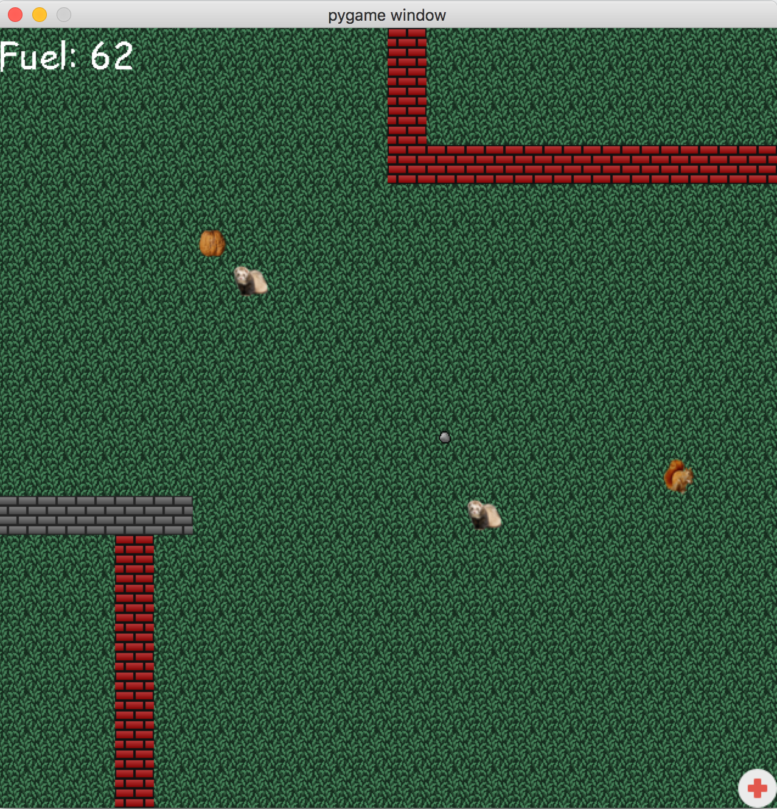

# CS 107 Project 7 -- Enemy AI and Parsing JSON in HaverQuest

**Due: Thu, Dec 3, 6PM**

In this project you'll be implementing a variety of features expanding
HaverQuest to a larger-scale game. The real point of this project is
to give you experience working with a large codebase. This project is
a bit more open-ended than the previous, allowing a little more
exploration on your end.

For this project, grading / testing will be largely based on us
playing your game and reading your code, since testing precise
characteristics of the game mechanics via unit tests is a bit
challenging here.

To load the game, you can do the same thing as last time:

    python3 game.py

The game is pretty boring right now, because you haven't implemented
the logic to make it do the cool stuff. You should think of this
project as the project where you start writing a lot of code. There's
no specific concept you're going to be exercising, but you'll be using
an ensemble of ideas to implement the main logic of HaverQuest.

Good luck! I hope you have a lot of fun.

## Part 1: Implementing Player Movement

This part will have you make players move. Right now, the players in
our game won't move at all. To make them move, we will associate
players a "speed vector." Players are implemented in the `Player`
class within the file `players.py`. You should take some time to read
through this class right now, as it is the superclass of all of the
things on the board that move.

In HaverQuest the game board is represented by a class named
`GameBoard`, implemented in `gameboard.py`. This class is comprised of
a matrix of "priority queue" data structures: ordered lists of tiles,
where the ordering occurs based on the tile's "priority," an attribute
set as the tile is built. Priorities are used to order tiles so that,
for example--when a player is sitting on top of a background--the
player appears on top of the background. This class contains several
important methods:

- `addTile`, which adds a tile to the board. Where it is added depends
  on the tile's position.

- `removeTile`, which removes a tile from the board. You will need to
  call this method during your assignment.

- `registerForClockTick`, which registers a tile to receive clock
  ticks, discussed next.

- `unregisterForClockTick`, which unregisters a tile to receive clock
  ticks.

Most games work by using a "game loop:" a big loop that gets called
many times per second to move characters, redraw parts of the screen,
and manage other parts of the game's state. Our game is no different,
and several times a second our game will process what are called
"clock ticks." You can find this in `gameLoop` within `game.py`. As a
result, each of the player's `clockTick` method will be called.

### Task 1: Implement `clockTick` in `Player`

You are to implement the `clockTick` function in the `Player`
class. Handle a clock tick event. This is the main method in the game
that will cause player movement. Be sure to use `self.move` for
movement, as some Player subclasses may override movement (e.g., to
subtract fuel). This method takes two arguments:
    
 - fps <-- The number of frames per second (i.e., number of
   times this method is called per second)
    
 - num <-- The number of frames since the last time this method
   was called.
    
As a result, this function should move the player the appropriate
amount based on the speed vector. The speed vector is given in "tiles
per second."
     
For example, let's say that self.speed = (10,10). This means that this
tile should move 10 tiles to the right every second, and also 10 tiles
down every second. So if `clockTick(10,1)` is called, this method
should move the player right one tile and down one tile (i.e., (x+1,
y+1)). However, let's instead say that self.speed is (5,5). Then...
    
- self.clockTick(10,1) should do nothing the first time it is
  called.
       
- self.clockTick(10,1) should move the tile right one tile
  and down one tile the *second* time it is called.
    
This accounts for the fact that objects will move across the board
with variable speeds.
   
There are several things to keep in mind here:
    
- To actually *perform* the movement, you should use the
  self.move(deltaX, deltaY) method, which takes a delta x and
  delta y (both in the range [-1,1]) and moves to (x + deltaX, y
  + deltaY)
    
- Sometimes you can't move. For example, AI players should not
  be able to walk through walls. If a player attempts to move to
  a tile to which it cannot move, you must set the `canMove`
  field to False (it should be set to True) otherwise.

Once you implement this method, things should start to move..!

## Part 2: Making Stones Move and Health Packs

As the game sits now, when you hit the space button, the squirrel will
throw a stone in the direction that the squirrel is pointing. For
example, when you boot up the game, the squirrel will be poised to
shoot to the right. But this isn't ready yet: you'll do that
later. For now, you'll just implement the logic to make the stones
move. For this, you'll override the `clockTick` method in the `Stone`
class.

### Task 2: Making Stones Move

This method will be called in the same way as `clockTick` on the
`Player` object, as this is a subclass of `Player`. Your clock tick method
should:

- Call the parent's `clockTick` method

- If the movement failed (e.g., because the stone hit a wall) you
  should remove this tile from the board (consider using one of the
  board's methods). Don't forget to also unregister for clock ticks.

### Task 3: Implementing the Health Object

The `Health` class implements a tile for a health pack. When the
squirrel walks over this tile, it should increment your health by 15
and remove the tile from the board.

Whenever another tile "bumps into" this tile, its
`handleCollisionWith` method will be called. You should implement this
function by:

- Check whether the tile being collided with is a squirrel

    - You can do this by checking the tile's `type`, or you can call
      `isSquirrel`.

- If it is, it should increment the fuel by 15 and *then* 
  remove the tile from the board.
  
    - Hint: the game board keeps track of fuel by a field named
      `state`. This object has a few methods, one of them being
      `incrementFuel`, the one you should use here.

- If it is not, it should not do anything.

## Part 3: Fire the Stones

The main logic for implementing the main character is in
`Squirrel`. Notably, the code that responds to key presses is in the
function `handleEvent`. This function moves the squirrel left, right,
up, or down, and also sets a "movement vector", which keeps track of
the last direction in which the squirrel is moving. This is useful for
keeping track of the fact that the squirrel should shoot up if it was
last traveling up. When the space bar is pressed, the `fireStone`
method is called.

### Task 4: Implement the `fireStone` method

This method should fire a stone. The stone should start at (x + mX,
y + mY) where (mX, mY) is the movement vector. For example, if the
squirrel is traveling to the right (because the last key pressed was
the right) and the squirrel is currently at (3, 2), then the stone
should start at (4, 2). Additionally, you must subtract 10 fuel after
firing a stone.

Note that you will need to:

- Check that the stone can actually start at that place. For example,
  if the stone should start at (4, 2) but there is a wall there, then
  you should not fire a stone.
- Add the stone to the board (otherwise it won't show up)
- Ensure there are at least 10 fuel tokens available
- Ensure that you make the stone register for clock ticks (otherwise
  it won't move)

### Task 5: Handle Collisions with Ferrets and Stones

Just like the health object, the squirrel should handle collisions
with other objects on the board. The rules are as follows:

If you collide with a...

- ferret <-- Subtract 15 fuel
- stone  <-- Subtract 10 fuel

## Part 4: Implementing Enemy AI

For this part, you'll code up an enemy AI. Your enemy AI will be
implemented as part of the `SqureAIFerret` class, the Squirrel's
enemy. The job of the Ferret is to start at some initial position,
walk five tiles to the right, walk down five tiles, walk left, walk
up, and then start all over again. While walking around in a square,
the ferret will fire stones in a random direction. Every seventh step,
the ferret will choose a random direction and fire a stone. In the
next assignment, we'll add more intelligence to this AI.

### Task 6: The `move` function

Move should implemented in such a way that the ferret AI character
walks around the board in a length 5 square. For example, if the
ferret starts at (5,5), the first step should be to (6,5), then (7,5)
and so on until reaching (10,5). At that point, it should start going
downwards to (10,6) until it reaches (10,10), at which point it should
go left. It should proceed to (5,10) until finally moving back up
towards (5,5 and starting over again).
    
Additionally, every seventh call to `move`, the ferret should fire a
stone by calling the `fireStone` function. As a hint: I would suggest
adding a `numTicks` member variable to this class and then
incrementing it upon each call to `move`.

### Task 7: The `fireStone` function

The job of this function is to fire a stone in a random direction,
with speed vector (x1 * self.SPEEDVECTOR, y1 * self.SPEEDVECTOR) where
x1 and y1 are both in [-1,1] but crucially x1 and y1 cannot *both* be
0 (otherwise the stone would just sit there). Just as in `Squirrel`,
your initial coordinate must be x + x1, y + y1.

### Task 8: The `subtractHp` function

Subtract HP, potentially killing off the character

Takes a single argument, hp. The result of calling this function
should be that:

- self.hp becomes subtracted by the relevant amount. 

- If the hp now becomes below 0, this tile should be removed from the
board.

## Scoring Breakdown

Although there are more points in this assignment, it will be worth
the same as the last projects. As this assignment is significantly
more open-ended than previous assignments, we'll be a bit flexible
when grading. For example, as long as we can see that you had the
right ideas and satisfied the spirit of the specification, we're happy
to give you the points.

Good luck!

- Task 1 [10]
- Task 2 [5]
- Task 3 [3]
- Task 4 [10]
- Task 5 [3]
- Task 6 [7]
- Task 7 [5]
- Task 8 [3]
- Style: [4]
- Total: 50
